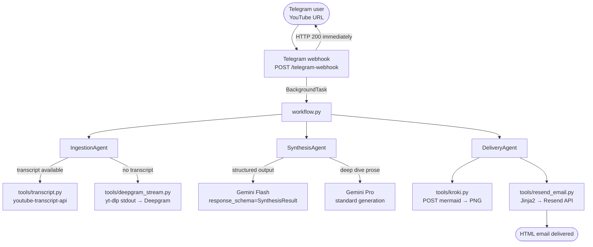

# tube-digest — Architecture & Implementation Specification

---

## 1. Purpose

An async multi-agent pipeline that accepts a YouTube URL via Telegram and delivers a
three-tier knowledge package — TL;DR, Deep Dive, and a visual concept map — as a
polished HTML email.

The pipeline is designed to run on **Google Cloud Run** with zero disk I/O and no
long-running background threads. Telegram's 10-second webhook timeout is handled by
returning HTTP 200 immediately and executing the entire workflow inside
`FastAPI BackgroundTasks`.

---

## 2. System Overview



---

## 3. Components

### Entry points

| File | Responsibility |
|---|---|
| `app/main.py` | FastAPI app; `/telegram-webhook` (POST) with `BackgroundTasks`; `/health` (GET) |
| `app/workflow.py` | Orchestrates `IngestionAgent → SynthesisAgent → DeliveryAgent` for one URL |

### Agents

| File | Responsibility |
|---|---|
| `app/agents/ingestion.py` | Tries `transcript.py`; falls back to `deepgram_stream.py` on `TranscriptsDisabled / NoTranscriptFound` |
| `app/agents/synthesis.py` | Two-pass Gemini call: Flash for structured `SynthesisResult`, Pro for deep-dive prose |
| `app/agents/delivery.py` | Renders diagram via Kroki, sends email via Resend |

### Tools

| File | Responsibility |
|---|---|
| `app/tools/transcript.py` | Extracts video ID from any YouTube URL format; runs `YouTubeTranscriptApi` in a thread executor; strips `[Music]`-style noise |
| `app/tools/deepgram_stream.py` | `yt-dlp -o -` async generator → `httpx` streaming POST to Deepgram; zero disk I/O; zero ffmpeg |
| `app/tools/kroki.py` | HTTP POST to `https://kroki.io/mermaid/png`; raw Mermaid string as body; returns PNG bytes |
| `app/tools/resend_email.py` | Renders `templates/email.html` via Jinja2; embeds diagram as base64 data URI; sends via Resend SDK |

### Schemas & templates

| File | Responsibility |
|---|---|
| `app/schemas/summary.py` | `SynthesisResult` Pydantic v2 model; `@field_validator` strips markdown code fences from `visual_map` |
| `app/templates/email.html` | Responsive Jinja2 HTML email — TL;DR card, deep-dive section, optional diagram, footer |

---

## 4. Critical Architectural Constraints

These four constraints are non-negotiable. Violating any one of them will cause the
system to fail in production.

### C-1 — Async webhook handling

Telegram webhooks time out after **10 seconds**. The `/telegram-webhook` endpoint
**must** return `HTTP 200 OK` immediately, before any AI or I/O work begins. The
actual workflow runs inside `FastAPI BackgroundTasks`.

```python
@app.post("/telegram-webhook")
async def telegram_webhook(request: Request, background_tasks: BackgroundTasks):
    payload = await request.json()
    background_tasks.add_task(run_workflow, payload)
    return {"ok": True}
```

### C-2 — Lightweight audio streaming (no ffmpeg, no /tmp)

When no transcript is available, audio is fetched with:

```bash
yt-dlp -f bestaudio -o - --no-playlist --quiet <URL>
```

The raw WebM/Opus bytes are piped from `asyncio.subprocess.PIPE` to Deepgram via an
`AsyncGenerator[bytes, None]` passed as the `content=` argument to
`httpx.AsyncClient.post`. **No ffmpeg. No files written to disk.**

Deepgram natively accepts `Content-Type: audio/webm`.

### C-3 — Kroki via HTTP POST (not GET)

Mermaid diagrams are rendered by posting the raw Mermaid string as the request body:

```
POST https://kroki.io/mermaid/png
Content-Type: text/plain; charset=utf-8

graph TD
    A --> B
```

**Never use the GET endpoint with base64/zlib encoding** — long diagrams exceed URL
length limits and will fail silently.

### C-4 — Pydantic field validator for Mermaid code fences

Gemini frequently wraps Mermaid output in a markdown code fence even when instructed
not to. The `SynthesisResult.visual_map` field has a `@field_validator` that strips
the fence before the string is passed to Kroki:

```python
@field_validator("visual_map", mode="before")
@classmethod
def strip_mermaid_code_fence(cls, v: object) -> str:
    stripped = v.strip()
    match = re.match(r"^```(?:mermaid)?\s*\n?([\s\S]*?)\n?```\s*$", stripped, re.DOTALL)
    return match.group(1).strip() if match else stripped
```

---

## 5. ADK Agent Pattern

Each agent uses `google-adk` for orchestration and `google-genai` for model calls.
The synthesis agent uses `response_schema` enforcement for the Flash model:

```python
from google import genai
from google.genai import types
from app.schemas.summary import SynthesisResult

client = genai.Client()

response = client.models.generate_content(
    model="gemini-2.0-flash",
    contents=transcript,
    config=types.GenerateContentConfig(
        response_mime_type="application/json",
        response_schema=SynthesisResult,
    ),
)
result = SynthesisResult.model_validate_json(response.text)
```

The Pro model is called for the `deep_dive` field without schema enforcement, as
long-form prose generation is less reliable with `response_schema`.

---

## 6. Pydantic Schema

`SynthesisResult` (in `app/schemas/summary.py`):

| Field | Type | Notes |
|---|---|---|
| `tldr` | `str` | One-paragraph executive summary |
| `deep_dive` | `str` | Multi-paragraph analysis; may contain markdown |
| `visual_map` | `str` | Raw Mermaid code — code fence stripped by `@field_validator` |

---

## 7. Environment Variables

| Variable | Required | Used by |
|---|---|---|
| `TELEGRAM_BOT_TOKEN` | Yes | `main.py` — webhook validation |
| `TELEGRAM_WEBHOOK_SECRET` | Recommended | `main.py` — `X-Telegram-Bot-Api-Secret-Token` header check |
| `GOOGLE_API_KEY` | Yes (or ADC) | `synthesis.py` — Gemini API |
| `DEEPGRAM_API_KEY` | Yes | `tools/deepgram_stream.py` |
| `RESEND_API_KEY` | Yes | `tools/resend_email.py` |
| `FROM_EMAIL` | Yes | `tools/resend_email.py` — verified sender address |
| `TO_EMAIL` | Yes | `workflow.py` — recipient |
| `GOOGLE_CLOUD_PROJECT` | No | Vertex AI ADC fallback |

---

## 8. Deployment

All runtime infrastructure targets **Google Cloud Run**. See
[docs/guide.md — For DevOps](guide.md#4-for-devops) for full deployment commands.

| Component | Platform |
|---|---|
| API + webhook | Cloud Run (single instance, `containerConcurrency=1`) |
| Container image | Artifact Registry / GCR |
| Secrets | Secret Manager → env vars at runtime |

`containerConcurrency=1` prevents concurrent webhook processing from racing on shared
in-process state. Cloud Run's scale-to-zero means no idle cost.
